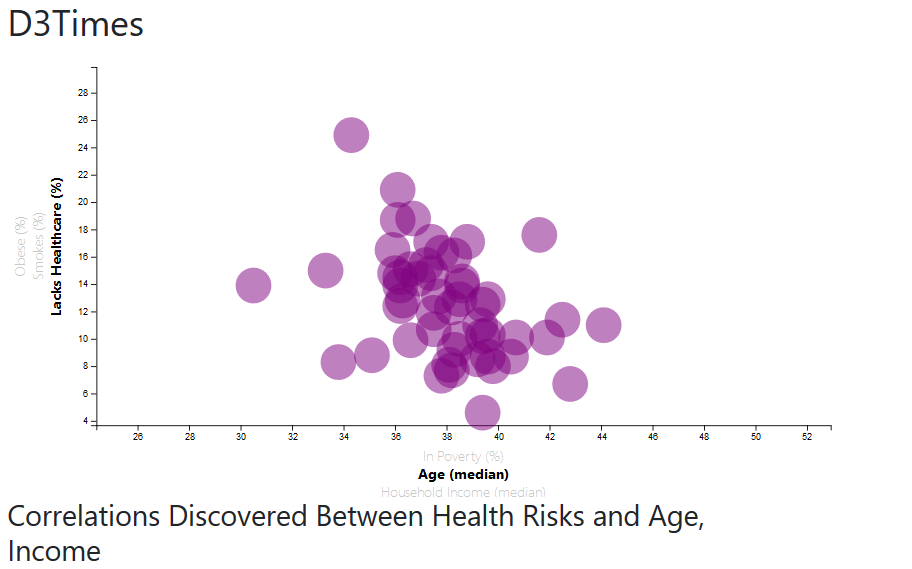

# Data Journalism and D3

## Overview
I have built a D3 Scatter-plot of health vs. demographics for each state in the US. 

The data set included is based on 2014 ACS 1-year estimates: [https://factfinder.census.gov/faces/nav/jsf/pages/searchresults.xhtml](https://factfinder.census.gov/faces/nav/jsf/pages/searchresults.xhtml).
The data set incldes data on rates of income, obesity, poverty, etc. by state. MOE stands for "margin of error."

### Visualization
The visualization includes a 3-variable x/y axis scatter plot where each bubble represents a state.
Information on the data can be viewed by mousing over the bubble which executes a tooltip display.

### Code Execution
Website must be executed using http.server. With access to the entire repository;
* with CLI or GitBash, type: python -m http.server
* open localhost:8000 on your browser

### Copyright

UCSD Data Science © 2019. All Rights Reserved.
